# Covid19-visualization
Analysis of transmission and human mobility data to visualize and extract insights in the spread of the disease

Introduction 

Why Belgium
Belgium detected the first novel coronavirus infection on February 4th, a few days after the first european cases were reported in Italy. Local transmission was confirmed in early March. By the end of the month, the disease had spread to all provinces within the country.
Belgium has one of the highest confirmed deaths per head of population in the world. This may be due to the reporting of the deaths of suspected cases along with confirmed ones, and because authorities include deaths that occur outside of hospitals.
The country has also experienced two rounds of strict lockdowns, in March and October, which were mandated to reduce the spread of the disease.
The high number of cases and deaths, along with the huge population mobility swings produced by the lockdowns make Belgium an interesting case to analyze.
The time period is March 1st, 2020 - November 30th, 2020 for questions 1-7. For questions 8-10 a single date can be selected for plotting.

Data Sources:
1. Our World in Data
​https://ourworldindata.org/coronavirus-data-explorer owid-covid-data.csv
2. Apple Mobility Data
https://covid19.apple.com/mobility
applemobilitytrends-2020-12-07.csv
3. John Hopkins
https://github.com/CSSEGISandData/COVID-19/blob/master/csse_covid_19_data/csse_covid_19_time _series/time_series_covid19_recovered_global.csv
time_series_covid19_recovered_global.csv
   
   
 Visualizations
1. Cumulative confirmed cases over time in Belgium
The disease was detected in Belgium during the first days of March. Starting May, the country had registered more than 50,000 cases in what was the first major spike in the country. This prompted lockdowns that led to a stall in the case count for a few months. After the restrictions had been lifted, cases started to climb again in unprecedented numbers. The higher count was caused by the more robust testing capacity during these months. In October, mobility restrictions were applied once more, which slowed the spread of the disease. Total cases by the end of November: 577.345.
Data for this plot was taken from the OWID dataset, column “total_cases” for Belgium. For dates ranging from March 1st 2020 to November 30th 2020.
 
 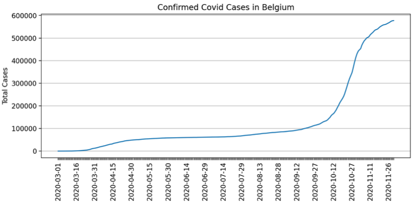
 
 2. Tests per confirmed case over time in Belgium
 This chart represents the inverse of the test positivity rate in the country. The lower the amount of tests per case, the higher rate of tests that come out positive. At the beginning of the pandemic, the country was still figuring out how to perform massive testing while cases surged. The testing rate numbers didn’t start to climb until the spread had gotten under control in May. While the rise in cases remained low, tests per case reached an all time high in mid June. Between June and October cases remained quite stable, so the decrease in test rate could be the result of less tests performed. By the start of October, as cases started to rise, the number of tests performed was insufficient and caused the testing rate to fall to levels not seen since the start of the pandemic. The highest number of tests performed per confirmed case happened on June 22nd 2020, with 195.8 tests per case.
Data for this plot was taken from the OWID dataset, column “tests_per_case” for Belgium. For dates ranging from March 1st 2020 to November 30th 2020.

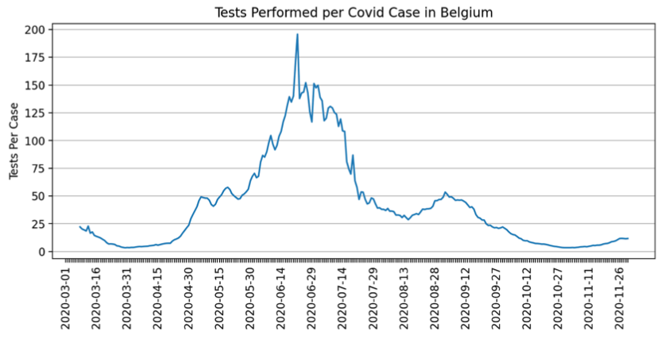
 
 3. Case fatality rate over time in Belgium
 As expected, with an unknown disease and overwhelmed hospitals, the fatality rate rose to its maximum levels at the start of the pandemic. It’s important to remember that since the beginning, Belgium reported more complete death statistics than the rest of the world. They included deaths in care homes, where older people were more prone to succumb to the disease. The decrease in rate could be explained by the discovery of better treatments later in the pandemic, or the increased availability of hospital beds. Another possibility could be the fact that the virus could have been spreading among younger people while individuals with more risk remained in isolation. The peak of deaths per confirmed case was reached on the 6th of May 2020 at 0.1642.
Data for this plot was taken from the OWID dataset, columns “total_deaths” and “total_cases” for Belgium. For dates ranging from March 1st 2020 to November 30th 2020. To calculate the case fatality rate, the values for deaths were divided by the amount of cases for each day in the specified range.

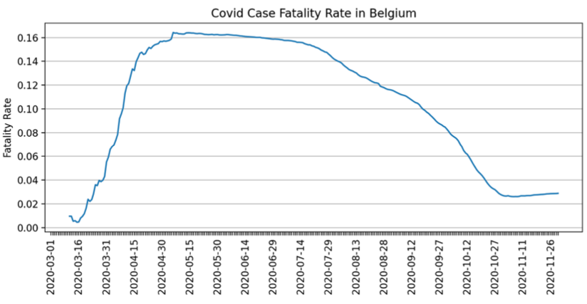
 
 4. Recovery rate over time in Belgium
 It’s important to point out that even though most people recover from the disease, to be part of the statistics there should be a negative test recorded after infection. It’s safe to say most people don’t get tested after recovery which makes these rates unrealistically low. Nevertheless, the trend and rate of change could be examined in this graph. The recovery rate was higher while the spread of the virus was under control due to lockdowns and elevated precautions. At the end of the graph rates drop because they occur during the highest surge of cases the country has had and people who are just contracting the disease are not reflected as recovered until some days later.
The data used for this plot was obtained from the John’s Hopkins University published covid data, specifically their recovered cases time series. Due to lack of data by the end of November, this plot only considers dates from March 1st to November 16th.

 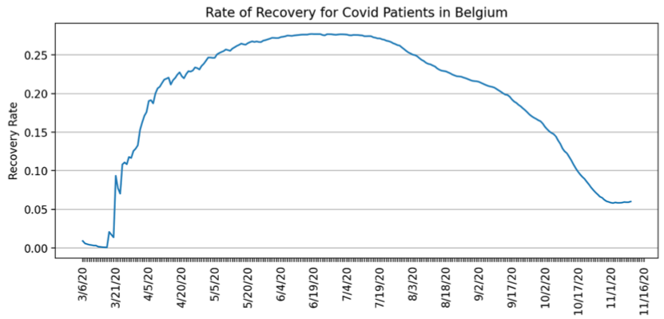
 
 5. 7 Days Moving Average for Test per Confirmed Cases and Fatality Rate for Belgium
Plot 1
Plot 2 – Y axis in Log scale

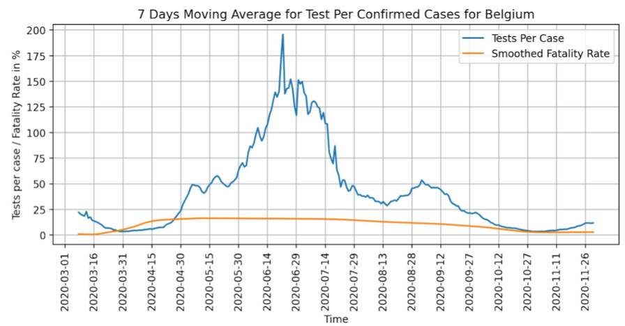
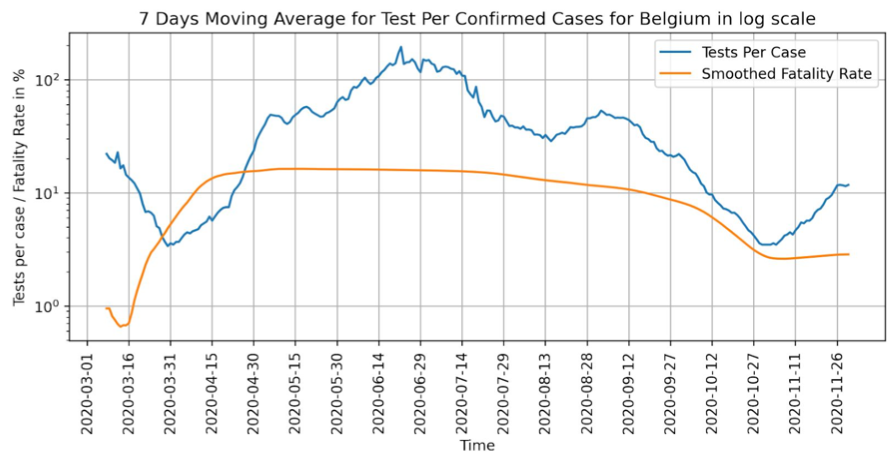
 
 The data used for this plot is taken from the Our World in Data website. The data was extracted for Belgium for March 1st, 2020 - Nov 30, 2020 timeframe. The following columns were used to create the plot: test per case, total deaths, total cases. The fatality rate was calculated by applying the below formula, to the total deaths, total cases values on a per day basis.
Fatality Rate = (number of deaths/ numbers of confirmed cases) *100 Smoothed fatality rate is 7 days rolling average of the Fatality Rate
Plot 1 is the resulting plot. However, taking into consideration the difference in ranges of the Tests per Case and the Fatality Rate the log scale plot provides a better visual representation for the relationship between the two variables.
Tests per case min = 3.4, max 195.8, mean = 41.24, sd dev = 41.22; Smoothed Fatality Rate min = 0.66, max 16.37, mean = 10.55, st dev = 5.4
The 7 days moving average for test per case and the fatality rate are negatively correlated based on this plot. The amount of Test per Case gets low when there is a spike in cases and Smoothed Fatality Rate gets high when there is a spike in cases. Tests conducted per new confirmed case of COVID-19, given as a rolling 7-day average (this is the inverse of positive rate).
The Smoothed Fatality Rate curve is consistent with the new virus outbreak. When at first it is unknown how to treat the virus, how to prevent the spread, and many people are not aware of it at all, the virus spreads fast, causing many fatalities. Then once more information and research about the virus is available, the preventative and treatment measures improve, and the fatality rate levels up and gradually declines.
The Tests per case decline sharply at first due to the influx of new Covid cases during March and then declines which most likely reflects the imposed quarantine. We also must take into consideration the amount of tests available and the percentage of the population that is being tested as well as the composition of the tested population. People such as first responders and medical workers must get retested regularly even if they do not have symptoms vs people who only get tested when they have symptoms. More information needed to clarify these points. The test per case number spiked once the lockdown was eased and which represents that more people got tested and there were lower rates of new corona cases, until the new cases spiked in November.
The Smoothed Fatality Rate stayed low in November, which contradicts the relationship and might indicate that the relationship between the Tests per Case and Smoothed Fatality Race can change depending on the availability of treatment and vaccinations.

 
 6. Mobility vs Transmission rate over time in Belgium
 This graph shows precisely the goal of administration officials when mandating lockdowns. There is a direct relationship between both of these rates, when mobility goes down, the transmission rate for covid-19 goes down as well. From the beginning of the year there’s a steep fall in both of these measurements that happened when the first lockdown was imposed. Later both indicators went up as the restrictions were eased out partially. Finally, towards the end, there’s another decline that coincides with the second mandated lockdown.
The data to build this plot was taken from the Apple Mobility Trend Reports, where the Walking, Transit and Driving mobility rates were averaged into a single column for easier comparison. The transmission rate was taken from the OWID dataset’s column “reproduction_rate”. For both sets of data, the dates taken were from March to November for Belgium.

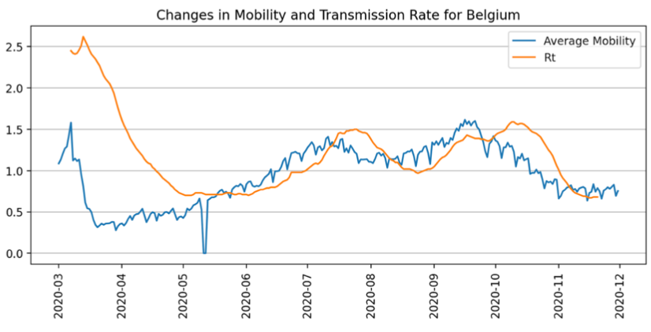
 
 7. Mobility vs Confirmed Cases and Total Tests and Total Deaths (Frequency in Log Scale) Over Time for Belgium.
The data used in this plot is from the Our World in Data – total tests, total cases, total deaths; and Apple Mobility Data – driving, walking, transit. The plot has y axis in log scale due to the large difference in ranges between the data from the two sources.
From the plot one can conclude that the number of testing, confirmed cases and deaths increased dramatically between 3/1 and 4/30, at the same time the mobility data for all 3 modes indicated that the mobility volume dropped significantly below the baseline during the same period of time. The baseline for mobility modes is a 100 based on the pre-Covid volume on January 13th, 2020. The overall drop in mobility volume can be attributed to the lockdown imposed from March till June. The transit experienced the largest drop on volume, since people tried to maintain social distance.
The total cases, total tests and total deaths are positively correlated. There is some positive correlation between mobility modes and total cases, total tests, and total deaths but it is not consistent along the timeline and it is different between each pair. This can be seen after the lock down ended in June and the mobility volumes returned to baseline levels for the Summer when many people take vacations, up until the end of September when mobility rates started dropping, but the total tests, total cases, and total deaths started to increase again. During the months of June through Sep the mobility volume increased and so did the testing volume; but the total cases and total deaths stayed almost the same. This uneven relationship can indicate that even though increased mobility rate correlates positively to the increase in the total amount of cases, tests, and deaths there are other factors influencing the amount of Covid cases, tests, and deaths that are not represented on this plot.
 
 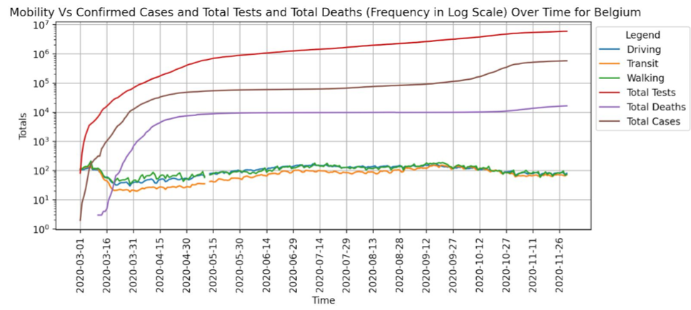
 
 From the mobility data for transit and driving it can be concluded that a lot of people have been working through pandemic and commuting to the workplace since the rates are high during the weekdays and drop on the weekends. Whereas the walking volume peaks every week around Saturday when most of the population is off.
 
8. HDI vs Current Transmission Rates for All Countries
On the vertical axis there is a clear distinction between the mean HDI for continents like Africa and Europe. While the other continents share about the same mean HDI. If we look at the horizontal axis, where transmission rate is plotted, Europe has a higher mean than the other continents. Taking both of these facts into account, we can determine a slight positive correlation between HDI and transmission rates. It’s important to point out that Africa, with smaller HDI and less resources, has experienced similar transmission rates as countries with better infrastructure. Experts are still debating whether this was caused by Africa’s more recent epidemics and better preparedness or by a generally younger population.
The data for this plot was taken from the OWID dataset, columns “human_development_index” and “reproduction_rate”. The HDI is constant for every country and the Rt value was taken from December 1st 2020.
 
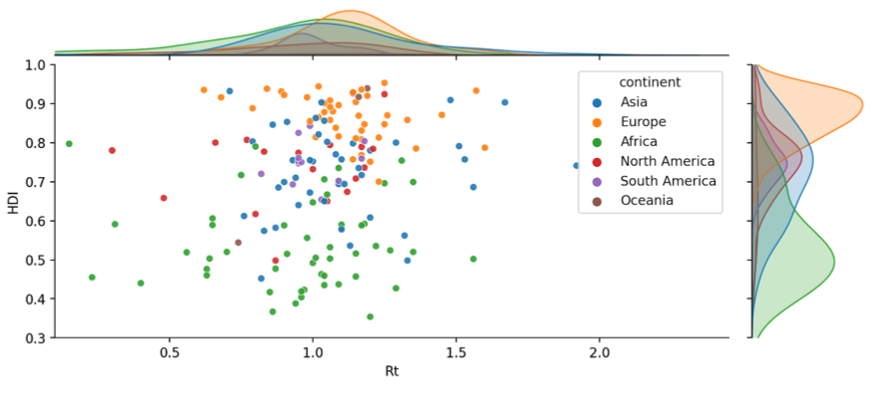 
 
 9. Current Confirmed Cases Vs Current Deaths of All Countries
 The data used for this plot is from Our world in data: total deaths per million, total cases per million. The selected date for both is 11/30/2020.
The total deaths per million for all countries is between 0 and 1436.20, with the mean of 99.85 and standard deviation of 194. The total cases per million for all countries is between 0 and 87296.97, with the mean of 3511.63 and standard deviation of 7049.51. The X and Y axes show distributions per continent.
The total deaths per million and total cases per million have a linear trend and are positively correlated. The plot confirms the current situation: the more people contract Covid the higher total number of deaths can be expected, even with the preventative measures in place and much better treatment that was developed and is currently available. Covid can still be deadly, especially for the patients that have underlying health issues.
Majority of the data available for this plot is from Europe, Asia, North and South America. The data from Africa and Oceania, some countries in Asia and South America shows a very small number of deaths and cases recorded, clustering between – and 5000 cases per million and under 100 deaths per million. Which can be attributed to inconsistent reporting and to a lower amount of testing being done compared to the continents and countries with larger numbers for values. European countries have the most data collected for both estimators. Europe is trending higher in death rate and cases.
Among Asia, Europe, North America, and South America, the majority of Asian countries have lower deaths per million numbers compared to the other continents. This might be due to countries such as China and Japan that have a majority of the population following strict social guidelines and always using personal protective measures such as masks and gloves.

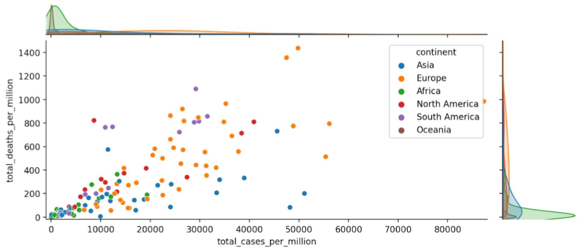
 
10. Life Expectancy Vs Current Death Rate of All Countries
  The data used for this plot is from Our world in data: life expectancy, total deaths, total cases. The Covid death rate is calculated using the formula: Covid deaths rate = total deaths / total cases. The selected date for the Covid death rate is 11/30/2020.
The life expectancy for all countries combined is between 53.28 and 86.75 years, with the mean of 72.89 and standard deviation of 7.57. The Covid deaths rate for the all countries combined is between 0.000498 and 0.28, with the mean of 0.023 and standard deviation of 0.025. The X and Y axes show distributions per continent.
Among the continents Africa has the lowest life expectancy, followed by Oceania and South America. North America, Europe, Asia have a higher life expectancy. All continents have very similar rates of Covid death rates between 0 and 0.075, with one outlier in Asia with death rate above 0.25, this country is Yemen with the rate of 0.28 on 11/30/2020. The Life expectancy and Covid Death rate have a linear trend but have no correlation based on this plot.
Having no correlation between these two variables at this point is expected since this pandemic has not been present long enough to affect key elements that determine life expectancy such as genetics, heredity, life conditions, diet, and lifestyle choices. One can make an argument that Covid did affect lifestyle choices of the majority of people, due to imposed lockdowns, however to determine if this would eventually have an effect on the life expectancy we would need to make a comparison several decades in the future in order to verify if the change in lifestyle choices became permanent.

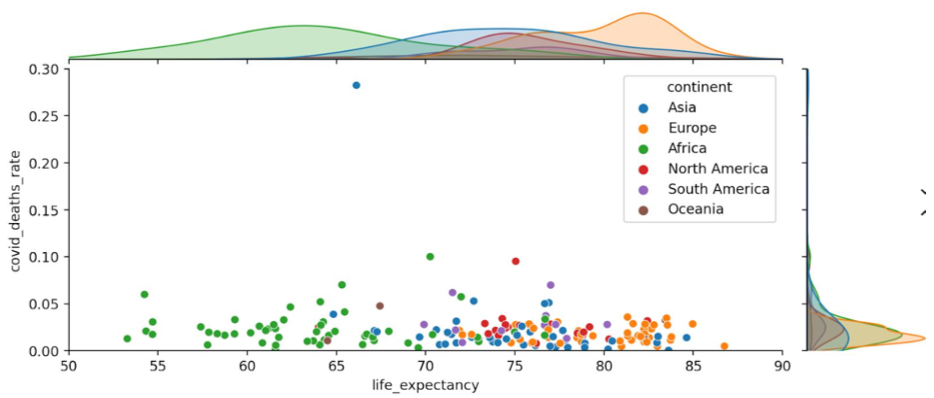
